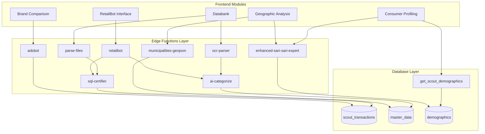

# Scout Analytics Edge Function Flows

## Visual Function Architecture



## Core Function Flows

### 1. RetailBot Query Flow
```
User Query → retailbot → sql-certifier → Database → jsonify → Response
                ↓
          ai-categorize
                ↓
          Context Enhancement
```

### 2. Geographic Analysis Flow
```
Map Request → municipalities-geojson → Cache Check → GeoJSON
                        ↓
              enhanced-sari-sari-expert
                        ↓
                 Demographic Overlay
                        ↓
                  Spend per Capita
```

### 3. Data Import Flow
```
File Upload → parse-files → Format Detection → ai-categorize
                  ↓                               ↓
            ocr-parser                    Category Assignment
                  ↓                               ↓
            sql-certifier → Database Insert ← Validation
```

### 4. Market Intelligence Flow
```
Brand Query → adsbot → Campaign Data
                ↓
          SKU Attribution
                ↓
          suki-bot → Market Simulation
                ↓
          Recommendations
```

## Function Dependencies

| Function | Depends On | Used By |
|----------|------------|---------|
| retailbot | sql-certifier, ai-categorize | Frontend, API |
| municipalities-geojson | - | enhanced-sari-sari-expert, Frontend |
| enhanced-sari-sari-expert | municipalities-geojson | Geographic Analysis |
| parse-files | sql-certifier, ai-categorize | Databank |
| adsbot | Database queries | Brand Comparison |
| ai-categorize | - | Multiple functions |
| sql-certifier | - | All SQL operations |
| ocr-parser | ai-categorize | Databank |
| suki-bot | Database queries | Market Analysis |

## Performance Optimization

### Caching Strategy
- `municipalities-geojson`: 1 hour cache
- `get_scout_demographics`: 5 minute cache
- `retailbot` responses: 5 minute cache for identical queries

### Rate Limiting Tiers
- **Tier 1 (High)**: jsonify (1000/min), sql-certifier (500/min)
- **Tier 2 (Medium)**: retailbot (100/min), ai-categorize (200/min)
- **Tier 3 (Low)**: parse-files (25/min), suki-bot (10/min)

### Function Chaining Rules
1. Always validate SQL with `sql-certifier`
2. Format all responses with `jsonify`
3. Cache geographic data aggressively
4. Batch demographic queries when possible

## Error Handling Flows

```
Function Error → Retry (3x) → Fallback → Error Response
                     ↓                        ↓
              Exponential Backoff       Log to Monitoring
                     ↓                        ↓
              Circuit Breaker          Alert if Critical
```

## Security Layers

1. **Input Validation**: All functions validate input schema
2. **SQL Injection Protection**: sql-certifier on all queries
3. **Rate Limiting**: Per-function and per-user limits
4. **Authentication**: Supabase RLS + API keys
5. **Audit Logging**: All function calls logged

## Deployment Architecture

```
┌─────────────────┐     ┌─────────────────┐     ┌─────────────────┐
│   Vercel CDN    │────▶│ Supabase Edge   │────▶│   PostgreSQL    │
│   (Frontend)    │     │   Functions      │     │   Database      │
└─────────────────┘     └─────────────────┘     └─────────────────┘
         │                       │                         │
         │                       ▼                         │
         │              ┌─────────────────┐               │
         └─────────────▶│   Redis Cache   │◀──────────────┘
                        └─────────────────┘
```