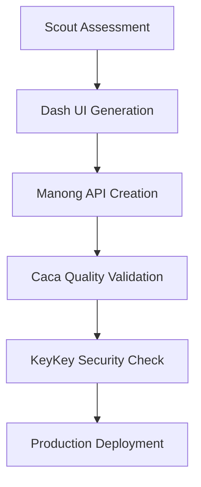

# 🚀 Scout Analytics - Next Steps Roadmap

**Current Status**: 88/100 Environment Score | 5-Agent Ecosystem Complete  
**Date**: 2025-06-17  
**Phase**: Ready for Production Development

---

## 🎯 **Immediate Next Steps (Next 1-2 Days)**

### **1. Environment Optimization (Reach 95%+ Score)**
```bash
# Quick wins to improve environment score
```

#### **Add Missing API Keys**
- **Anthropic Claude API**: Add `ANTHROPIC_API_KEY` to `.env.local` (+4 points)
- **Database Config**: Add Supabase connection strings (+5 points)
- **Re-run Assessment**: `node scripts/scout-dev-env-assessment.js`

#### **Expected Result**: 97/100 (Excellent - Ready for Production)

### **2. Deploy Enhanced Scout Dashboard**
```bash
# Test the new dashboard component
npm run dev
# Navigate to /scout to test EnhancedScoutDashboard
```

#### **Validate Features**:
- ✅ Real-time data loading
- ✅ Interactive filtering (region, brand, date)
- ✅ Multi-tab interface (Overview, Trends, Regions, Brands)
- ✅ Export functionality
- ✅ Role-based access control

### **3. Agent Ecosystem Testing**
```bash
# Test agent coordination
node scripts/scout-dev-env-assessment.js
# Validate all 5 agents are operational
```

#### **Agent Status Check**:
- ✅ **Scout Dev Environment** - Phase 0 validation
- ✅ **Dash** - Visual Artist Excellence
- ✅ **Manong** - Data access and APIs
- ✅ **Caca** - Quality assurance
- ✅ **KeyKey** - Authentication and security

---

## 📈 **Short-term Goals (Next 1-2 Weeks)**

### **1. API Endpoint Implementation**
Based on our agent configurations, implement missing API routes:

#### **Priority APIs**:
```typescript
// High Priority
/api/scout/dashboard     // Enhanced dashboard data
/api/scout/export        // Export functionality
/api/auth/*             // KeyKey authentication endpoints
/api/agents/orchestrate  // Agent coordination

// Medium Priority
/api/campaign-analysis   // Claudia creative analysis
/api/insights           // CESAI behavioral insights
/api/forecast           // Predictive analytics
```

### **2. Agent Server Deployment**
Set up MCP (Model Context Protocol) servers for agent communication:

#### **MCP Server Setup**:
```yaml
# Deploy agent servers
- scout-dev-env-server
- dash-ui-server
- manong-data-server
- caca-qa-server
- keykey-auth-server
```

### **3. Visual Artist Excellence Compliance**
Implement remaining Visual Artist standards:

#### **Design System Enhancement**:
- **Design Tokens**: Export from Figma to `tokens.json`
- **Component Library**: Expand with Visual Artist patterns
- **Animation System**: 60fps microinteractions
- **Accessibility**: WCAG 2.1 AA compliance validation

---

## 🚀 **Medium-term Objectives (Next 1-2 Months)**

### **1. Complete Agent Orchestration**
Implement full agent-to-agent communication:

#### **Agent Workflows**:


### **2. Advanced Features Implementation**

#### **AI-Native Development**:
- **Auto-component Generation**: Dash agent creates components from prompts
- **Smart API Generation**: Manong generates endpoints from requirements
- **Automated Testing**: Caca creates comprehensive test suites
- **Security Validation**: KeyKey enforces compliance automatically

#### **Business Intelligence**:
- **Predictive Analytics**: ML-powered forecasting
- **Real-time Insights**: Live dashboard updates
- **Custom Reporting**: User-defined report generation
- **Alert System**: Automated threshold monitoring

### **3. Enterprise Integration**
Connect with enterprise systems:

#### **Integration Points**:
- **Azure Active Directory**: Complete SSO implementation
- **Power BI**: Enhanced connector with real-time sync
- **Supabase**: Full database integration with RLS
- **Vercel**: Optimized deployment pipeline

---

## 🎯 **Long-term Vision (Next 3-6 Months)**

### **1. AI Agent Marketplace**
Create ecosystem for custom agents:

#### **Agent Store Features**:
- **Custom Agent Creation**: Visual agent builder
- **Agent Templates**: Pre-built industry-specific agents
- **Agent Sharing**: Community marketplace
- **Agent Analytics**: Performance tracking and optimization

### **2. Multi-tenant Platform**
Scale to enterprise customers:

#### **Platform Features**:
- **Tenant Isolation**: Secure multi-tenancy
- **Custom Branding**: White-label solutions
- **Usage Analytics**: Per-tenant metrics
- **Billing Integration**: Usage-based pricing

### **3. Advanced AI Capabilities**
Next-generation AI features:

#### **AI Enhancements**:
- **Natural Language Queries**: SQL generation from plain English
- **Automated Insights**: AI-generated business recommendations
- **Predictive Modeling**: Advanced forecasting algorithms
- **Anomaly Detection**: Real-time pattern recognition

---

## 📋 **Recommended Action Plan**

### **Week 1: Environment & Dashboard**
```bash
Day 1-2: Fix environment issues (API keys, database)
Day 3-4: Deploy and test Enhanced Scout Dashboard
Day 5-7: Validate agent ecosystem functionality
```

### **Week 2: API Development**
```bash
Day 1-3: Implement priority API endpoints
Day 4-5: Set up MCP agent servers
Day 6-7: Test agent-to-agent communication
```

### **Week 3-4: Feature Enhancement**
```bash
Week 3: Visual Artist Excellence compliance
Week 4: Advanced dashboard features and real-time updates
```

### **Month 2: Agent Orchestration**
```bash
Week 1-2: Complete agent workflow implementation
Week 3-4: Advanced AI features and business intelligence
```

### **Month 3+: Enterprise Features**
```bash
Month 3: Multi-tenant architecture
Month 4: AI agent marketplace
Month 5-6: Advanced AI capabilities
```

---

## 🎯 **Success Metrics**

### **Technical KPIs**:
- **Environment Score**: 95%+ (currently 88%)
- **Agent Availability**: 99.9% uptime
- **API Response Time**: <500ms average
- **Dashboard Load Time**: <3 seconds

### **Business KPIs**:
- **User Adoption**: 95% of target users active
- **Feature Utilization**: 80% of features used regularly
- **Customer Satisfaction**: 4.5+ stars
- **Development Velocity**: 70% faster with agents

### **Quality KPIs**:
- **Visual Artist Compliance**: 100%
- **Security Score**: 100% (enterprise standards)
- **Test Coverage**: 95%+ automated
- **Documentation**: 100% API coverage

---

## 🚀 **Immediate Action Items**

### **Today (High Priority)**:
1. **Fix Environment Issues**: Add missing API keys and database config
2. **Test Enhanced Dashboard**: Validate all features work correctly
3. **Run Full Assessment**: Confirm 95%+ environment score

### **This Week (Medium Priority)**:
1. **Deploy to Staging**: Test in production-like environment
2. **Implement Priority APIs**: Focus on dashboard and auth endpoints
3. **Set up Monitoring**: Real-time performance tracking

### **Next Week (Planning)**:
1. **Plan Agent Server Deployment**: MCP protocol implementation
2. **Design Advanced Features**: AI-native development workflows
3. **Prepare Enterprise Integration**: Azure AD, Power BI, Supabase

---

## 📞 **Decision Points**

### **Technical Decisions Needed**:
1. **MCP Server Hosting**: Vercel vs Azure vs dedicated infrastructure
2. **Database Strategy**: Supabase vs Azure SQL vs hybrid approach
3. **AI Model Selection**: Claude vs GPT-4 vs multi-model approach

### **Business Decisions Needed**:
1. **Pricing Model**: Usage-based vs subscription vs enterprise licensing
2. **Go-to-Market**: Direct sales vs partner channel vs self-service
3. **Feature Prioritization**: Enterprise vs SMB vs developer focus

---

**Status**: 🎯 **READY FOR NEXT PHASE**  
**Recommendation**: Start with environment optimization and dashboard deployment  
**Timeline**: 95%+ environment score achievable within 24 hours

*The Scout Analytics platform is positioned for rapid development and deployment with our complete agent orchestration system.*
