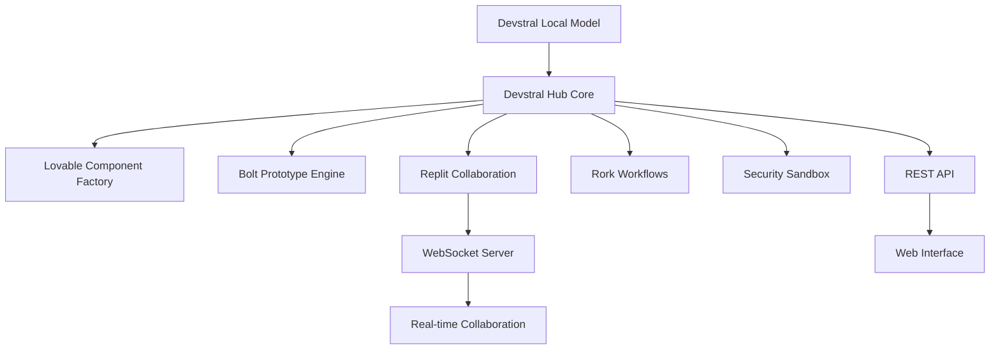

# 🚀 Local Development Platform

A comprehensive reverse-engineered implementation of **Rork AI**, **Lovable.dev**, **Bolt.new**, and **Replit** capabilities running entirely locally with **Devstral** as the AI engine.

## 🎯 What This Platform Does

This platform replicates the core functionality of major AI development tools:

- **🎨 Lovable.dev**: Component factory for generating React components with shadcn/ui patterns
- **⚡ Bolt.new**: Rapid prototyping engine with multiple framework templates  
- **👥 Replit**: Real-time collaborative editing with WebSocket support
- **🔄 Rork**: AI-powered workflow orchestration and automation
- **🧠 Devstral Hub**: Direct local AI integration with 128K context
- **🛡️ Security Sandbox**: Safe code execution environment

## 🏗️ Architecture



## 📋 Prerequisites

1. **Ollama** installed and running
2. **Devstral model** downloaded
3. **Node.js** 18+ installed

### Quick Setup

```bash
# Install Ollama (if not already installed)
curl -fsSL https://ollama.ai/install.sh | sh

# Start Ollama
ollama serve

# Download Devstral model (14GB - may take time)
ollama pull devstral:latest
```

## 🚀 Quick Start

### Option 1: Automated Setup
```bash
./start.sh
```

### Option 2: Manual Setup
```bash
# Install dependencies
npm install

# Start platform
npm start

# Or development mode
npm run dev
```

### Option 3: Direct Execution
```bash
# Start with custom ports
node index.js --port 3000 --wsPort 3001 --model devstral:latest
```

## 🌐 Usage

Once started, access the platform at:

- **Web Interface**: http://localhost:3000
- **WebSocket API**: ws://localhost:3001  
- **REST API**: http://localhost:3000/api/*

## 📚 API Reference

### Lovable.dev Component Factory

**Create Component:**
```bash
POST /api/lovable/component
{
  "type": "button",
  "props": {
    "variant": "primary",
    "size": "lg",
    "children": "Click me!"
  }
}
```

**Create Project:**
```bash
POST /api/lovable/project
{
  "name": "my-app",
  "components": [
    {
      "type": "button",
      "props": { "variant": "primary" }
    }
  ]
}
```

### Bolt.new Prototype Engine

**Create Project:**
```bash
POST /api/bolt/project
{
  "template": "react",
  "options": {
    "name": "my-prototype",
    "features": ["routing", "state-management"],
    "dependencies": ["react-icons", "tailwindcss"]
  }
}
```

**Get Templates:**
```bash
GET /api/bolt/templates
```

### Rork Workflow Orchestration

**Run Workflow:**
```bash
POST /api/rork/workflow/run
{
  "name": "component-factory",
  "input": {
    "type": "card",
    "requirements": "Modern card component for products"
  }
}
```

**Register Custom Workflow:**
```bash
POST /api/rork/workflow/register
{
  "name": "custom-workflow",
  "steps": [
    {
      "id": "step1",
      "type": "ai",
      "prompt": "Generate code for: {{input.requirement}}",
      "outputVar": "code"
    }
  ]
}
```

### AI Chat Integration

**Direct Chat:**
```bash
POST /api/ai/chat
{
  "prompt": "Create a TypeScript interface for User",
  "context": {
    "temperature": 0.7,
    "history": []
  }
}
```

**Code Generation:**
```bash
POST /api/ai/generate
{
  "language": "TypeScript",
  "framework": "React",
  "features": ["user-management", "authentication"],
  "styling": "Tailwind CSS"
}
```

### Security Sandbox

**Execute Code Safely:**
```bash
POST /api/sandbox/execute
{
  "code": "const result = Math.random() * 100; result;",
  "context": {}
}
```

**Execute Workflow:**
```bash
POST /api/sandbox/workflow
{
  "workflowCode": "function(input) { return input.value * 2; }",
  "input": { "value": 42 }
}
```

### Replit Collaboration

**WebSocket Events:**

```javascript
const ws = new WebSocket('ws://localhost:3001');

// Join collaboration room
ws.send(JSON.stringify({
  type: 'join-room',
  data: {
    roomId: 'project-123',
    user: { name: 'Developer', id: 'user-1' }
  }
}));

// Send document edit
ws.send(JSON.stringify({
  type: 'document-edit',
  data: {
    roomId: 'project-123',
    documentId: 'file.js',
    operation: {
      type: 'insert',
      position: 100,
      text: 'console.log("Hello");'
    }
  }
}));
```

## 🔧 Configuration

### Environment Variables

```bash
# Platform configuration
PORT=3000                    # HTTP server port
WS_PORT=3001                # WebSocket server port
OLLAMA_HOST=http://localhost:11434  # Ollama server
MODEL_NAME=devstral:latest   # AI model to use

# Security settings
SANDBOX_ENABLED=true         # Enable security sandbox
SANDBOX_TIMEOUT=5000        # Code execution timeout (ms)

# Development settings
NODE_ENV=development        # Environment mode
DEBUG=true                  # Enable debug logging
```

### Custom Configuration

```javascript
const LocalDevPlatform = require('./index');

const platform = new LocalDevPlatform({
  port: 3000,
  wsPort: 3001,
  model: 'devstral:latest',
  sandboxEnabled: true,
  ollamaHost: 'http://localhost:11434'
});

platform.start();
```

## 🛡️ Security Features

### Sandbox Protection
- **VM isolation** for code execution
- **File system restrictions** to safe directories only
- **Module whitelisting** prevents dangerous imports
- **Pattern blocking** for malicious code detection
- **Timeout controls** prevent infinite loops

### Access Controls
- **Path traversal protection** 
- **Resource limits** on memory and CPU
- **Network isolation** in sandbox
- **API rate limiting** (configurable)

### Security Testing
```bash
# Run security tests
npm run sandbox-test

# Manual security verification
node -e "
const SecuritySandbox = require('./security/sandbox');
new SecuritySandbox().testSecurity().then(console.log);
"
```

## 🔄 Workflow Templates

### Pre-built Workflows

1. **Code Generation Pipeline**
   - Analyze requirements → Design architecture → Generate code → Create tests

2. **Component Factory**  
   - Design component → Generate variants → Implement → Create stories

3. **API Development**
   - Design API → Generate OpenAPI spec → Implement server → Generate client

4. **Test Automation**
   - Analyze code → Generate unit tests → Integration tests → E2E tests

5. **Deployment Pipeline**
   - Analyze project → Generate Dockerfile → Create CI/CD → K8s manifests

### Custom Workflows

```javascript
// Register custom workflow
const steps = [
  {
    id: 'analyze',
    type: 'ai', 
    prompt: 'Analyze this requirement: {{input.requirement}}',
    outputVar: 'analysis'
  },
  {
    id: 'implement',
    type: 'ai',
    prompt: 'Implement based on: {{analysis}}',
    outputVar: 'implementation'
  }
];

// Via API
fetch('/api/rork/workflow/register', {
  method: 'POST',
  headers: { 'Content-Type': 'application/json' },
  body: JSON.stringify({
    name: 'my-workflow',
    steps: steps
  })
});
```

## 📊 Monitoring & Stats

### Platform Status
```bash
GET /api/status
```

### Collaboration Stats  
```bash
GET /api/replit/stats
```

### Workflow Analytics
```bash
GET /api/rork/workflows
```

## 🚀 Deployment

### Local Development
```bash
npm run dev
```

### Production Mode
```bash
NODE_ENV=production npm start
```

### Docker Deployment
```bash
# Build image
docker build -t local-dev-platform .

# Run container
docker run -p 3000:3000 -p 3001:3001 \
  -v $(pwd)/sandbox:/app/sandbox \
  local-dev-platform
```

## 🧪 Testing

### Run All Tests
```bash
npm test
```

### Security Tests
```bash
npm run sandbox-test
```

### Integration Tests
```bash
# Test all modules
curl http://localhost:3000/health
curl http://localhost:3000/api/status
```

## 🔍 Troubleshooting

### Common Issues

**"Devstral model not found"**
```bash
ollama pull devstral:latest
```

**"Connection refused to Ollama"**
```bash
ollama serve
```

**"Sandbox security tests failing"**
```bash
# Check VM2 installation
npm ls vm2

# Reinstall dependencies  
rm -rf node_modules && npm install
```

**"WebSocket connection failed"**
- Check port 3001 is not in use
- Verify firewall settings
- Check WebSocket URL in client

### Debug Mode
```bash
DEBUG=true npm run dev
```

### Logs Location
- Platform logs: Console output
- Sandbox logs: `./logs/sandbox.log`
- Error logs: `./logs/error.log`

## 🤝 Integration Examples

### With Existing Projects

```javascript
// Add to existing Express app
const LocalDevPlatform = require('local-dev-platform');
const platform = new LocalDevPlatform({ port: 4000 });

app.use('/dev-platform', platform.app);
```

### Custom AI Models

```javascript
// Use different model
const platform = new LocalDevPlatform({
  model: 'codellama:13b',
  ollamaHost: 'http://remote-ollama:11434'
});
```

### External Integrations

```javascript
// Connect to external services
platform.hub.on('component-created', async (component) => {
  // Save to database
  await database.components.create(component);
  
  // Trigger webhook
  await webhook.notify('component-created', component);
});
```

## 📄 License

MIT License - See LICENSE file for details.

## 🙏 Acknowledgments

Inspired by the excellent work of:
- [Rork AI](https://rork.ai) - Workflow orchestration patterns
- [Lovable.dev](https://lovable.dev) - Component generation approach  
- [Bolt.new](https://bolt.new) - Rapid prototyping concepts
- [Replit](https://replit.com) - Collaborative editing features
- [Mistral AI](https://mistral.ai) - Devstral model

---

**Built with ❤️ for local-first AI development**